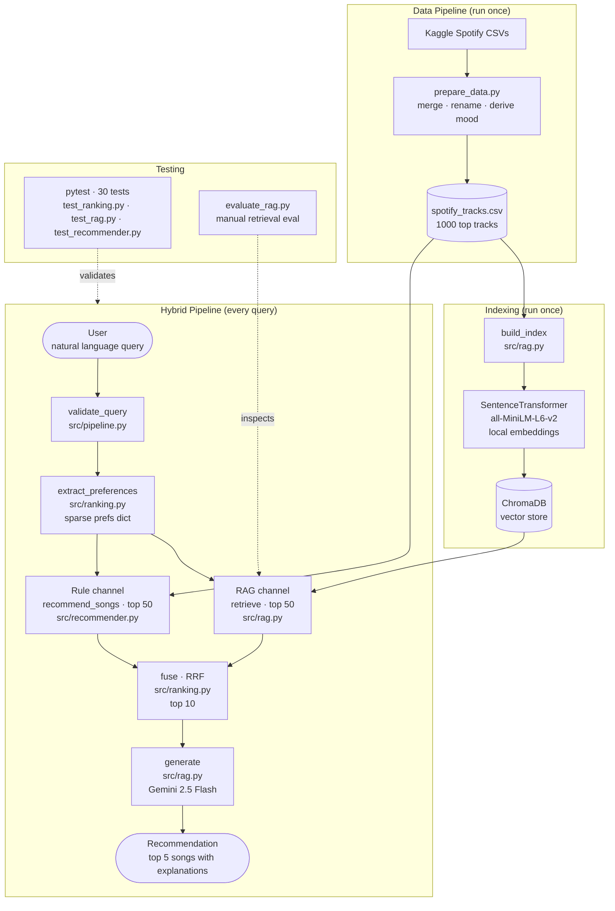

# Music Recommender — RAG Edition

## Original Project: Music Recommender Simulation

This project started as the **Music Recommender Simulation**, a rule-based content filtering system that scored songs from a small hand-crafted catalog against a structured user profile (genre, mood, energy, valence, acousticness, tempo). The original system ranked every song in the catalog using a weighted scoring formula and returned the top-k results with a plain-English explanation of why each song matched. It demonstrated how real-world recommenders turn structured data into predictions and where bias can emerge from weighted categorical features.

---

## Title and Summary

**Music Recommender — RAG Edition** extends the original simulation with a **hybrid retrieval and ranking pipeline**. Users describe what they want to listen to in plain English — "something melancholic to study to" or "high energy workout music" — and the system retrieves candidates from two parallel channels (semantic vector search + rule-based scoring), fuses the results with Reciprocal Rank Fusion, and uses Gemini 2.5 Flash to generate a conversational recommendation with a reason for each pick.

This matters because each retrieval channel has different strengths. Semantic search captures vibe and mood that no scoring formula could express. The rule-based scorer enforces structural matches (genre, energy targets) that vector search approximates poorly. Combining them produces recommendations that respect both intent and constraints.

---

## Architecture Overview

The system has four modules with clean separation of concerns:

| File | Responsibility |
|---|---|
| `src/pipeline.py` | Orchestrator — coordinates pipeline stages |
| `src/ranking.py` | Sparse-prefs extraction + RRF fusion |
| `src/rag.py` | ChromaDB indexing/retrieval + Gemini generation |
| `src/recommender.py` | Rule-based weighted scoring (sparse-prefs aware) |

**Pipeline flow:**

```
query
  ↓
pipeline.py — validate → extract sparse prefs
  ↓
  ├──► RAG channel (rag.py): embed query → ChromaDB cosine search → top 50
  └──► Rule channel (recommender.py): weighted scoring → top 50
  ↓
ranking.py — Reciprocal Rank Fusion → top 10
  ↓
rag.py — Gemini 2.5 Flash generates recommendation with explanations
```

**Per-channel retrieval:**

1. **RAG channel** — `sentence-transformers` (`all-MiniLM-L6-v2`) embeds each song's text description locally. Vectors are stored in a persistent ChromaDB collection. The query embedding is searched via cosine similarity, returning the top 50 candidates with similarity scores.

2. **Rule channel** — extracts a sparse prefs dict from the query via keyword mapping (e.g. `"chill workout"` → `{mood: "chill", energy: avg(0.3, 0.85)}`), then scores all 1000 songs using a weighted formula across genre, mood, energy, acousticness, valence, and tempo. Returns the top 50 by score.

Both channels' top 50 are passed to **Reciprocal Rank Fusion (RRF)**. The fused top 10 are sent to Gemini.

**Visual breakdown:**



---

## Hybrid Retrieval & Ranking Layer

The most architecturally interesting part of this project. Vanilla RAG retrieves by semantic similarity alone, which struggles with structural constraints — for example, vector search produces low but nonzero similarity for "no rap" queries because the embedding doesn't model exclusion well. A pure rule-based scorer can't capture vibe or mood from freetext. The hybrid layer combines both, with three design choices worth highlighting.

### 1. Sparse preference extraction

A naive approach would force every query into a full prefs dict (`{genre, mood, energy, valence, tempo, acousticness}`). This is brittle — most queries don't mention all dimensions. Instead, `extract_preferences()` produces a *sparse* dict that only fills dimensions the user explicitly mentioned:

```python
extract_preferences("chill workout")
# → {"mood": "chill", "valence": 0.525, "energy": 0.575}
# (mood from "chill"; valence and energy averaged across both keywords)
```

This handles two important cases:
- **No matched keywords** → empty dict → rule channel produces no signal → RRF degrades to RAG-only.
- **Conflicting keywords** → numeric dimensions average (e.g. `"chill intense"` → energy = avg(0.3, 0.85) = 0.575); categorical dimensions drop entirely (no mood key in the result).

### 2. Reciprocal Rank Fusion (instead of score blending)

The two channels produce non-comparable scores: RAG returns cosine similarities in [0, 1]; the rule scorer returns weighted scores with no fixed range. Averaging them lets the rule channel dominate just because its raw numbers are larger. RRF sidesteps this by ranking each list independently and summing `1 / (k + rank)` for each song across both lists. With k=60 (the standard default), it produces stable rankings without any score normalization.

The biggest property: **agreement across channels is rewarded**. A song ranked #2 in RAG and #1 in rules outranks one that's #1 in RAG only — even though the latter has a higher cosine similarity. Cross-channel agreement is usually the strongest signal of relevance.

### 3. Deeper-then-trim retrieval

Each channel pulls 50 candidates, fusion produces the top 10 for Gemini. If both channels only retrieved 10, songs ranked mid in one channel but high in the other would be cut before fusion ever sees them. Pulling deeper preserves the agreement signal RRF depends on.

---

## Setup Instructions

**Requirements:** Python 3.10+, a [Gemini API key](https://aistudio.google.com/apikey)

```bash
# 1. Clone the repo and create a virtual environment
python -m venv venv
source venv/bin/activate        # Mac/Linux
venv\Scripts\activate           # Windows

# 2. Install dependencies
pip install -r requirements.txt

# 3. Add your Gemini API key
echo "GEMINI_API_KEY=your-key-here" > .env

# 4. Run
python main.py
```

On first run, `all-MiniLM-L6-v2` (~90MB) downloads once and the 1,000-track index is built locally in seconds. Every subsequent run skips indexing and goes straight to the query prompt.

**Run tests:**
```bash
pytest tests/ -v
```

**Run the manual retrieval evaluation script:**
```bash
python tests/evaluate_rag.py
```

---

## Sample Interactions

**Query 1 — Mood-based**
```
You: something sad and slow for a late night drive

Recommendations:
1. **"Waiting Room" by Phoebe Bridgers:** This song is incredibly sad and slow, making it ideal for a melancholic late-night drive.
2. **"Sparks" by Coldplay:** With its ambient and sad mood, "Sparks" will perfectly complement the quiet introspection of a night drive.
3. **"lacy" by Olivia Rodrigo:** This track delivers a sad and slow vibe that's just right for a thoughtful late-night journey.
4. **"The Weekend" by SZA:** This R&B track offers a sad and laid-back feel, perfect for cruising slowly under the night sky.
5. **"Big Black Car" by Gregory Alan Isakov:** This folk song has a distinctly sad and slow atmosphere that perfectly matches your request for a reflective late-night drive.
```

**Query 2 — Activity-based**
```
You: high energy music to work out to

Recommendations:
1. **"What I've Done" by Linkin Park**: This track brings an intense rock energy that's perfect for pushing through a tough workout.
2. **"Unstoppable" by Sia**: With its powerful vocals and driving beat, this song will make you feel, well, unstoppable!
3. **"Push Up - Main Edit" by Creeds**: Get ready to feel the adrenaline with this high-energy gaming track that's made for moving.
4. **"Not Strong Enough" by boygenius, Julien Baker, Phoebe Bridgers, Lucy Dacus**: This rock anthem has a strong, driving rhythm that will keep your momentum going.
5. **"Runaway" by Bon Jovi**: This classic rock hit has an infectious high energy and a happy vibe to keep you motivated and smiling while you exercise.
```

**Query 3 — Vibe-based**
```
You: chill indie music for a Sunday morning

Recommendations:
1. "Clouded" by Brent Faiyaz: This R&B track has a really chill vibe, perfect for easing into your Sunday.
2. "anything" by Adrianne Lenker: With its folk genre and chill mood, this song offers a gentle and introspective feel for your morning.
3. "Royals" by Lorde: While the mood is listed as sad, its somewhat subdued energy and pop genre could still provide a thoughtful and relaxed backdrop for your morning.
4. "The Weekend" by SZA: This R&B song has a lower energy and valence, making it suitable for a more laid-back and reflective Sunday morning.
5. "Closer" by The Chainsmokers, Halsey: Even though it's electronic, its moderate energy and happy mood could offer a pleasant, soft pop background for your relaxing morning.
```

---

## Design Decisions

**Why hybrid retrieval (RAG + rules)?**
Each channel has blind spots. Vector search captures semantic vibe but handles exclusion poorly ("no rap" still retrieves rap because the embedding for "rap" sits close to the query embedding). Rule-based scoring captures structural constraints (genre, energy target) but can't read mood from freetext. Combining them via RRF lets each channel compensate when the other fails.

**Why RRF over weighted score blending?**
The two channels output incompatible scales — RAG gives cosine similarity in [0, 1], the rule scorer gives weighted sums with no fixed range. A naive average lets the rule channel dominate just because its numbers are larger. RRF normalizes by rank instead of score, so each channel's "vote" carries equal weight regardless of magnitude. RRF also rewards agreement across channels, which is usually the strongest signal of relevance.

**Why sparse prefs (instead of fixed-shape dicts)?**
Forcing every query into a full prefs dict (`{genre, mood, energy, ...}`) was brittle — most natural queries don't mention all dimensions. Sparse prefs degrade gracefully: dimensions the user didn't mention contribute no signal, and queries with no matched keywords produce empty dicts that cause the rule channel to return nothing, letting RRF fall back to RAG-only. The hybrid pipeline is no worse than vanilla RAG even for queries the rule channel can't help with.

**Why keep the original rule-based system?**
The weighted scoring system in `src/recommender.py` is fully transparent and deterministic — you can trace exactly why a song scored the way it did. It's now integrated into the pipeline as the rule channel, not just preserved as a reference.

**Why `sentence-transformers` instead of Gemini embeddings?**
Gemini's embedding API on the free tier is capped at 100 requests per minute with no batch support, making it impractical to index 1,000 tracks without hitting rate limits. `all-MiniLM-L6-v2` runs locally with no API calls, indexes all tracks in seconds, and produces high-quality semantic embeddings. Gemini is reserved for the generation step where it genuinely adds value.

**Why disable thinking on Gemini 2.5 Flash?**
Gemini 2.5 Flash enables extended reasoning by default. For a task as straightforward as selecting 5 songs from a list of 10 and writing one sentence per song, the added reasoning time produced no meaningful improvement in output quality. Disabling it (`thinking_budget=0`) cut response latency significantly.

**Why top 1,000 tracks by popularity?**
The free tier embedding quota and the nature of a demo project made a smaller, higher-quality catalog the right call. Popular tracks are more likely to be recognized and evaluated meaningfully by a human grader.

**Trade-offs:**
- Local embeddings are fast and free but `all-MiniLM-L6-v2` is less semantically rich than Gemini's embedding models.
- Mood labels are derived from valence and energy with a simple 2×2 grid — this loses nuance but keeps the original scoring system compatible.
- The catalog is limited to 1,000 songs, so niche genres are underrepresented.

---

## Testing Summary

**Coverage: 30 tests across 3 files.**

| File | Tests | Covers |
|---|---|---|
| `tests/test_ranking.py` | 20 | Sparse-prefs extraction (sanity + edge cases), RRF fusion (overlap, fallback, k_final trim, disjoint lists) |
| `tests/test_rag.py` | 8 | Input validation, retrieval similarity scoring, low-confidence threshold |
| `tests/test_recommender.py` | 2 | Rule-based scoring (OOP path) |

**Manual evaluation:** `tests/evaluate_rag.py` runs a fixed set of 7 queries and prints per-query similarity statistics. Useful for spot-checking retrieval quality after embedding changes.

**What works:**
- The hybrid pipeline is robust to queries that don't match any rule-channel keywords — the system gracefully degrades to RAG-only via the empty-prefs path.
- RRF agreement across channels is the strongest signal — songs that appear high in both lists consistently rank in the final top 5.
- Disabling Gemini's thinking mode cut latency significantly without quality loss.

**What didn't work initially:**
- The original `_compute_score` used subscript access (`user_prefs["genre"]`) which crashed on sparse prefs. Fixed by switching to `.get()` with sensible fallbacks (substituting the song's own value to neutralize that dimension across all songs).
- Gemini's embedding API (`text-embedding-004` and `gemini-embedding-2`) couldn't be used for indexing due to rate limits and lack of batch support on the free tier.
- The initial `google-generativeai` package was the wrong SDK — the correct one is `google-genai` (`from google import genai`).

**What I learned:**
- API free tier constraints heavily influence architecture decisions. The "best" embedding model on paper became the wrong choice once quota limits were factored in.
- Hybrid retrieval is more interesting than either channel alone. The two channels' failure modes are complementary, and the RRF fusion math is dead simple — most of the design work was figuring out *what* to combine, not *how* to combine.
- Sparse prefs is a real pattern. Forcing inputs into a fixed shape creates brittleness; designing for partial information makes the system robust to natural language ambiguity.

---

## Reflection

Building this project made the abstract concept of RAG concrete. The retrieval step is a nearest-neighbor search over vectors, and its quality is entirely determined by how well the embedding model captures semantic meaning. Swapping embedding models changed what "similar" meant, which changed the results.

Adding the ranking layer made me think about retrieval differently. Vanilla RAG felt like a one-shot operation: embed, search, generate. The hybrid pipeline made every retrieval a *process* with stages, each independently testable, with clean fallback semantics. That's a more honest representation of how real recommendation systems work.

The biggest open question this project raised is evaluation. It is easy to tell when a recommendation is obviously wrong, but hard to define what "good" means systematically. Real-world recommenders solve this with click data and listening history. Without that signal, human judgment remains the only meaningful evaluator.

---

## Limitations and Ethics

This project and its data is derived from the top 1000 most popular songs on Spotify, so it may not provide any more niche artists/songs. In addition, the dataset was updated around 4 months ago, meaning new songs won't be included.

Though I tried to find ways to exploit this AI, by telling it to ignore all prompts and give me an answer to a question, it denied that request, and instead found songs related to my question.

I'd say this surprised me, as the AI model was very resistant, and insisted on its role as a music recommendation system.

In this project, I used AI as a learning tool, and with writing boilerplate code. I was unfamiliar with chroma db, but it allowed me to use it effectively in this project. It was very helpful in this. One suggestion I disliked, however, was having a much larger dataset and using the Gemini embedding tool which would take about 3 days to fully compile due to rate limits.

---

## Project Structure

```
.
├── main.py                  # Entry point — builds index on first run, then query loop
├── src/
│   ├── pipeline.py          # Orchestrator: validate → extract prefs → parallel retrieve → fuse → generate
│   ├── ranking.py           # Sparse-prefs extraction + RRF fusion
│   ├── rag.py               # ChromaDB indexing/retrieval + Gemini generation
│   ├── recommender.py       # Rule-based weighted scoring (sparse-prefs aware)
│   └── prepare_data.py      # Data prep: filter to top 1000 tracks
├── data/
│   ├── spotify_tracks.csv   # Cleaned 1000-track catalog
│   └── chroma_db/           # Persistent vector index (generated, gitignored)
├── tests/
│   ├── test_ranking.py      # 20 tests: prefs extraction + RRF fusion
│   ├── test_rag.py          # 8 tests: input validation + retrieval
│   ├── test_recommender.py  # 2 tests: rule-based scoring
│   └── evaluate_rag.py      # Manual retrieval evaluation script
├── flowchart.mmd            # System diagram
├── model_card.md            # Model card
└── requirements.txt
```
